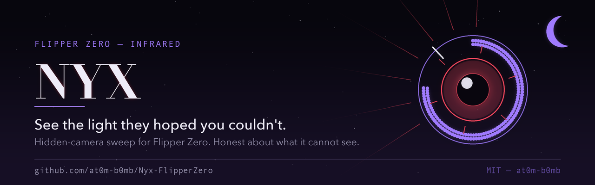
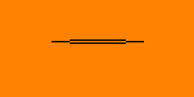
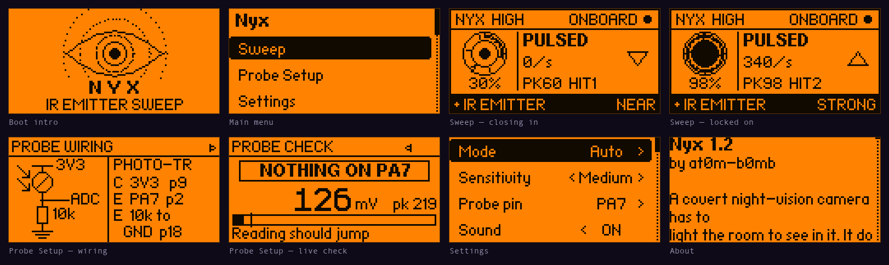

<div align="center">



**See the light they hoped you couldn't.**

**[Project site &rarr;](https://at0m-b0mb.github.io/Nyx-FlipperZero/)**

[](https://github.com/at0m-b0mb/Nyx-FlipperZero/actions/workflows/build.yml)
[](https://github.com/at0m-b0mb/Nyx-FlipperZero/releases/latest)
[](LICENSE)
[](#which-build-do-i-download)


</div>

<p align="center">
  
</p>
<p align="center">
  <sub>A sweep, start to finish: the eye opens &rarr; a quiet room &rarr; the ring fills and
  <b>locks on</b> &rarr; sensitivity, live &rarr; the probe wiring and its live check.</sub>
</p>

A covert night-vision camera has to light the room to see in it. It does that
with 850/940 nm infrared your eyes cannot register. Nyx turns that giveaway into
a meter you can walk around a hotel room or an Airbnb.

---

## Read this first — what Nyx can and cannot see

This is the part most "hidden camera detector" apps quietly skip, and it is the
whole reason to trust or distrust a reading. Nyx is honest about it on the
device and here.

Nyx finds **IR emitters**, not cameras. A camera only shows up while it is
actively lighting the room with infrared. That is exactly what a night-vision
camera does in the dark — so Nyx is at its best doing a **lights-off sweep** of
a dark room, which is also when a covert camera is most likely emitting.

There is a second catch, and it comes from the Flipper's hardware.

### The two modes, and why there are two

| | **Onboard** (no extra hardware) | **Probe** (+ ~$1 phototransistor) |
|---|---|---|
| Sensor | Built-in **TSOP-75338** IR receiver | IR phototransistor on a GPIO ADC pin |
| Sees **steady** DC illuminators | ❌ **No** | ✅ **Yes** |
| Sees **pulsed / modulated** IR | ✅ Yes | ✅ Yes |
| Finds a typical night-vision camera | ⚠️ Only if it pulses its LEDs | ✅ **Yes** |
| Setup | Just run it | Wire a probe (2 min, see below) |

The Flipper's onboard IR receiver is a **demodulating** part: it has a band-pass
filter centred on 38 kHz and automatic gain control, built to pull TV-remote
codes out of a sunlit room. That filter **throws away steady light**. A covert
camera whose IR illuminator runs at constant DC current — very common — is
**invisible** to the onboard receiver no matter how bright it is. A clean `0` in
onboard mode does **not** mean the room is clean. Onboard mode still catches
anything *pulsed*: remotes, IR beacons and link ports, PIR sensor floodlights,
and illuminators driven by PWM.

To actually catch a **steady** illuminator you need a sensor without that
filter. That is what **Probe mode** is: a bare IR phototransistor on an ADC pin,
which reads DC light directly and can even tell a steady illuminator apart from
a mains-flickering lamp. It costs about a dollar and two minutes. If you are
serious about a sweep, wire the probe.

**Auto mode** uses the probe if one is plugged in, otherwise the onboard
receiver, and the header always tells you which one is live.

### A worked example, because this is the part that matters

Here is Nyx against a real dome camera whose IR illuminator is clearly running
— the LEDs glow visibly through a phone camera. Flipper held directly in front
of it, onboard mode, sensitivity High, logged straight off the device:

```
143 of 155 windows   eps=0    act=0%    duty=0     ← silence
  4 of 155 windows   eps=40-60  act=10-15%         ← brief blips
```

**Nyx reports nothing, and that is the correct answer for this sensor.** That
illuminator runs at steady DC, and the onboard TSOP-75338 is built to reject
exactly that. A detector that lit up here would be inventing a result.

Against a TV remote — a genuinely *pulsed* source — the same screen locks on
solidly at 98%, `PULSED`, `STRONG`.

This is the whole reason Probe mode exists, and the whole reason the sweep
screen keeps telling you `Onboard: pulsed IR only` and `Steady IR? Use Probe`
while it is running. If you are sweeping for cameras rather than remotes, wire
the probe.

---

## Straight off the device

<p align="center">
  
</p>
<p align="center">
  <sub>
    Not mockups, and not a rendering of the layout constants either &mdash;
    <b>real framebuffer reads off a Flipper Zero</b> over its RPC session, in the
    amber of the actual panel. <a href="#tooling">The tool that captures them</a>
    ships in this repo.
  </sub>
</p>

---

## Using it

### The sweep screen

The meter is built around an **eye that watches back**, and every part of it is
there to answer "am I getting warmer":

- The **ring fills clockwise** with the live level and the **pupil dilates** as
  you close on a source.
- The single **tick on the ring** is your best reading so far. The game is to
  push the ring past the tick.
- The **arrow** on the right is the honest get-warmer cue — ▲ rising, ▼ falling,
  a flat bar for holding steady.
- When it locks on, glare spikes spin around the iris, the bottom strip inverts,
  and the geiger clicks speed up as the reading climbs — so you can hunt with
  the screen at your side rather than staring at it.

Kill the room lights, then pan the Flipper slowly across walls, smoke detectors,
alarm clocks, vents, mirrors, and anything with a pinhole.

### Reading the source label

- **STEADY** — flat DC light. This is the **night-vision illuminator
  signature**. Probe mode only.
- **FLICKER** — ~100/120 Hz ripple. Riding the mains, so almost always a lamp,
  a heater, or a screen — not a camera.
- **PULSED** — faster modulation. A remote, a beacon, or a PWM-driven
  illuminator.

### Keys

| Key | Where | Action |
|-----|-------|--------|
| **OK** | Sweep | Zero the peak-hold and hit count |
| **Hold OK** | Sweep | Re-null the ambient baseline (probe mode) — do this after walking into a new room |
| **← / →** | Sweep | Sensitivity down / up, **live**. The current setting is named in the header |
| **← / →** | Probe Setup | Flip between the wiring diagram and the live check |
| **OK** | Probe Setup | Clear the peak reading |
| **Back** | anywhere | Leave the screen / the app |

Changing sensitivity mid-sweep also zeroes the peak and hit count: readings
taken against a different noise floor are not the same measurement, and mixing
them would quietly lie to you.

### The rest of the menu

- **Probe Setup** — how to wire the phototransistor, plus a **live check** so
  you can prove the probe works (aim a TV remote at it and watch the needle
  jump) before you trust a clean sweep.
- **Settings** — mode, sensitivity, probe pin, sound / vibro / LED, and whether
  to play the boot intro. Your choices are **saved** and restored next launch.
- **About** — the same honesty notes, on the device.

---

## Install

### Which build do I download?

A `.fap` bakes in the API version of the SDK it was compiled against, and the
loader refuses to run one that is ahead of your firmware. There is no single
build that serves both firmware lines, so **every release ships two**:

| Your firmware | Download | Built against |
|---|---|---|
| **Official / stock** Flipper firmware | **`nyx.fap`** | release channel, API 87 |
| **Unleashed · RogueMaster · Momentum** | **`nyx-fw-dev.fap`** | dev channel, API 88 |

If you see `API version mismatch` or `app might not work` in the loader, you
have the other one — grab its counterpart.

Download from the [latest release](https://github.com/at0m-b0mb/Nyx-FlipperZero/releases/latest)
and drop it in `apps/Infrared/` on your Flipper's SD card (qFlipper, or the
mobile app). It shows up under **Apps → Infrared → Nyx**.

### From source

```bash
python3 -m pip install --upgrade ufbt
git clone https://github.com/at0m-b0mb/Nyx-FlipperZero.git
cd Nyx-FlipperZero
ufbt update --channel=release   # or --channel=dev for Unleashed/RogueMaster/Momentum
ufbt                            # builds dist/nyx.fap
ufbt launch                     # build + install to a connected Flipper
```

<a name="tooling"></a>

Regenerate the art after editing the generators:

```bash
python3 tools_gen_icons.py
python3 tools_gen_banner.py
```

Capture fresh screenshots and the demo GIF from a connected Flipper. These drive
the app over the protobuf RPC session and read the real framebuffer, so what you
get is the device, not a rendering of it:

```bash
python3 tools_screenshot.py --all        # every screen + images/screens.png
python3 tools_screenshot.py --tour-gif   # images/nyx-demo.gif
python3 tools_screenshot.py --alarm      # wait for a real detection, capture it
```

Each screen is written twice: `screenshots/<name>.png` at the native 128x64 in
plain 1-bit (what the Flipper app catalog wants) and `screenshots/<name>@4x.png`
in the Flipper's amber, which is what the README and the site use.

---

## Building the probe (optional, but it's the real tool)

You need one part: an **IR phototransistor** — the dark-epoxy kind with a
daylight filter, sold for pairing with 940 nm IR LEDs — and one **10 kΩ**
resistor. It wires as an emitter-follower: more IR in, more volts out.

```
        3V3  (pin 9)
         │
        ┌┴┐   IR phototransistor
    IR →│ │   (collector to 3V3)
        └┬┘
         ├───────────►  ADC pin — PA7 (pin 2) by default
        ┌┴┐
        │ │  10 kΩ
        └┬┘
         │
        GND  (pin 18)
```

| Phototransistor lead | Wire to | Flipper pin |
|---|---|---|
| Collector | 3V3 | pin 9 |
| Emitter | ADC in + one end of 10 kΩ | **PA7, pin 2** |
| (10 kΩ other end) | GND | pin 18 |

You can pick any ADC-capable pin under **Settings → Probe pin** — in the order
the picker offers them, `PA7` (pin 2), `PA6` (3), `PA4` (4), `PC3` (7), `PC1`
(15), `PC0` (16). The list is built from the SDK's own GPIO table rather than
hardcoded, and the Probe Setup screen always shows the pin it currently expects
by its silkscreened number, so trust the screen over this table. Nyx detects the
probe automatically by sensing the load on the pin.

Then open **Probe Setup → →** and press a key on any TV remote pointed at the
phototransistor. If the reading jumps, you're good.

---

## Limits — please read

- **Nyx finds emitters, not cameras.** A camera sitting in a lit room (no IR
  needed) or switched off emits nothing, and Nyx will not see it. Do a
  **lights-off** sweep.
- **IR reflects.** A strong reading can be a bounce off a wall or mirror rather
  than the source. Move around; triangulate on the peak.
- **The world is full of IR.** Sunlight, incandescent and halogen bulbs, remote
  controls, and PIR sensors all emit it. Treat a hit as *a reason to look
  closely*, not as proof. Confirm with your eyes — most phone cameras (front
  cameras especially) see 850 nm IR as a faint purple glow, so cross-check by
  looking at the suspected source through a phone.
- Nyx is a **triage tool** to point you at things worth inspecting. It is not a
  guarantee, and no RF/IR gadget is.

---

## How it works

- **`helpers/ir_sense.c`** — the dual-path engine, on a worker thread that runs
  one priority step below the UI (the probe burst busy-waits, and at the default
  priority that competes with the view dispatcher for the core).
  - *Onboard:* `furi_hal_infrared_async_rx_*` with a capture ISR that counts
    output edges per window. Edge-rate is the activity metric; we never decode,
    because we don't care *what* is transmitted, only *that* something is.
  - *Probe:* `furi_hal_adc_*` sampling a dense 32 ms burst each window, reduced
    to mean level (nulled against the ambient baseline captured at arm time),
    peak-to-peak ripple, and a mean-crossing ripple frequency that separates a
    steady illuminator from mains flicker. Oversampling is deliberately **off**
    so the ripple survives.
  - The probe pin list is built from the SDK's own `gpio_pins[]` ADC table, so
    it can't drift from the HAL.
- **`views/sweep_view.c`** — the locating instrument: the eye gauge, the source
  label, the get-warmer arrow, and an inverted alarm strip. Each measurement is
  named in exactly one place, and in onboard mode the idle hint keeps admitting
  that it can only see pulsed IR.
- **`views/probe_view.c`** — the wiring schematic and the live probe check.
- **`views/splash_view.c`** — the boot intro: a Nyx eye opening through IR
  wave-rings (any key skips it; turn it off in Settings).
- **`helpers/nyx_store.c`** — settings persistence via the firmware's
  `saved_struct`, with every loaded index clamped and every bool normalised
  before use, because the SD card is writable by anything.
- **`scenes/`** — splash / start / sweep / probe / settings / about, wired with
  the standard Flipper scene-manager X-macro.
- **`tools_screenshot.py`** — pulls real frames off a connected Flipper over the
  protobuf RPC session, for the screenshots above.

**Listen-only.** Nyx never transmits IR.

---

## Credits & license

Built by [**at0m-b0mb**](https://github.com/at0m-b0mb). MIT licensed — see
[LICENSE](LICENSE).

Part of a family of Flipper counter-surveillance tools:
[Specter](https://github.com/at0m-b0mb/Specter-FlipperZero) (NFC reader sweep),
[Argus](https://github.com/at0m-b0mb/Argus-FlipperZero) (Wi-Fi deauth detector),
[GhostTag](https://github.com/at0m-b0mb/GhostTag-FlipperZero) (BLE tracker hunter).

> Use Nyx to protect your own privacy and only in spaces you are entitled to
> sweep. You are responsible for complying with local law.
